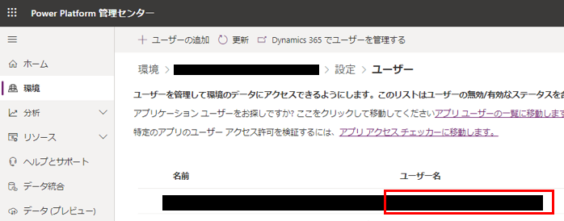
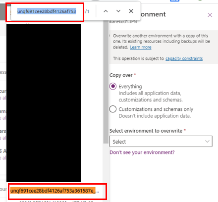

#  サポート インスタンスの提供

こんにちは、Power Platform サポートチームの鎌田です。

本記事では弊社サポート サービスでお問合せいただいたお客様に向けてご案内していますサポート インスタンスを紹介します。

## 概要

サポート インスタンスとは、お客様の問題を再現、解決するための環境です。サポート インスタンスには、マイクロソフトのサポート部門や開発部門が管理者権限でアクセスを行うことができます。そのため、お客様より事象が発生しているインスタンスをサポート インスタンスに向けてコピー作業を実施していただくことで、弊社にてご事象の再現と調査を一貫して行うことが可能です。
サポート インスタンスの作成にご了承いただける場合は下記手順にてご対応をお願いいたします。

---
1. [サポートインスタンス作成条件の確認](#anchor-about-criteria)
2. [情報の提供](#anchor-about-information)
3. [サポートインスタンスのコピー](#anchor-about-copy)

## 1. サポートインスタンス作成条件の確認

サポート インスタンスを作成するために次の条件を満たす必要がございます。
* お問い合わせは、事象発生環境の [Power Platform 管理センター](https://admin.powerplatform.microsoft.com/) から起票されている。
* お問い合わせ起票者に、事象発生環境でシステム管理者権限が割り当てられている。
* お問い合わせにおいて、サポートインスタンス作成の同意レベルを、下記いずれかに設定されている。
    * 診断情報へのアクセスで [最小限のコピー](https://learn.microsoft.com/ja-jp/power-platform/admin/copy-environment#copy-over-customizations-and-schemas-only) を許可する
    * 診断情報へのアクセスで [フル コピー](https://learn.microsoft.com/ja-jp/power-platform/admin/copy-environment#copy-over-everything) を許可する
  [サポート リクエストを作成した後、同意を付与または取り消すにはどうすればよいですか?](https://learn.microsoft.com/ja-jp/power-platform/admin/support-environment#how-do-i-grant-or-revoke-consent-after-i-create-a-support-request) を参考に、同意いただけるレベルを、どちらか設定ください。

上記条件により、パートナー様 A 社が、お客様 B 社環境で発生する事象について、A 社のテナントから調査依頼を起票するシナリオでは、サポートインスタンスの作成ができません。調査においてサポートインスタンスが必要となる場合、B 社テナントから、お問い合わせを新規ご起票くださいますようお願いいたします。
こちらは、[サポート環境と顧客データへのアクセスへの同意](https://learn.microsoft.com/ja-jp/power-platform/admin/support-environment) に説明されます通り、お客様のプライバシーを尊重し、サポートを受ける際の同意のレベルをお客様が管理できるようにする措置のためでございます。

## 2. 情報の提供
1. サポートインスタンス作成条件の確認(#anchor-about-criteria) が完了しましたら、サポートインスタンス作成のため、Microsoft サポートへ次の情報をご提供ください。
* 事象発生環境 URL (\***.crm\*.dynamics.com)
* 事象発生環境をサポートインスタンスへコピーするユーザーの UPN
　当該ユーザーは、事象発生環境にてシステム管理者権限が割り当てられている必要がございます。
　UPN は Power Platform 管理センター ＞ 環境 ＞ 設定 ＞ ユーザー のユーザー名より確認できます。

提供いただいた情報より、Microsoft にてサポートインスタンスを作成し、サポートインスタンス環境名をお問い合わせ起票者へご連絡いたします。

## 3. サポートインスタンスのコピー

Microsoft エンジニアより、サポートインスタンス環境名が通知されましたら、2. 情報の提供(#anchor-about-information) にて、ご共有いただきました UPN のユーザーにて、コピー操作をお願いいたします。

1. 当該 UPN のユーザーにて、 [Power Platform 管理センター](https://admin.powerplatform.microsoft.com/) へサインインします。

2. 左ペインより [環境] をクリックし、さらに、事象が発生しているインスタンスをクリックします。

3. 事象が発生しているインスタンスが開いたら、上部メニューの [コピー] をクリックします。

4. [環境のコピー] が右ペインに表示されます。[上書きコピー] や [上書きする環境を選択します] を設定します。設定は担当のサポート エンジニアより指定された項目をお選びください [(※1)](#注釈) 。その後、「私は、Microsoft がオンライン サービスの運用に…」 からはじまる注意書きを確認、チェックをつけた後に、最下段の [コピー] をクリックします。

5. 確認のダイアログでは [確認] をクリックします。

6. コピーが開始されますので、お待ちください。各フェイズが [開始前] [進行中] [成功] と進展していきます。

7. コピーが完了しましたら、以下の [編集] ボタンをクリックします。

8. [管理モード] を [有効] から [無効] にし [保存] をクリックします [(※2)](#注釈) 。

9. 提供手順は終了です。担当エンジニアまで完了の旨をご連絡ください。

## 補足

- 本手順は執筆時点の弊社検証環境でのユーザー インターフェイスを基に紹介しております。不明点がございましたら、担当のサポート エンジニアまでご相談ください。
- 作成したインスタンスはお客様のテナントのストレージ容量には影響ございません。
- 監査ログはコピーするか否かを選択することができます。監査ログをコピーすると、環境のコピーにかかる時間が大幅に長くなる可能性があり、既定では実行されません。 [こちらのページ](https://learn.microsoft.com/ja-jp/power-platform/admin/copy-environment#copying-audit-logs) の操作を実行することで、環境コピーに監査ログを含めることができます。
- サポート インスタンスは、既定では7日間で自動削除されますが、サポート エンジニアの調査状況により削除が延長される場合があります。この場合についても、調査が終了した後に自動削除されます。

## 注釈
- (※1) [環境のコピー] で、サポート インスタンス名が長すぎることなどが原因で、サポート インスタンスを見つけられない場合は、Ctrl + F で検索が可能です。

- (※2) 一部のお客様より [管理モード] が変更できない動作をお寄せいただいております。その場合、データ センター上で同作業を行いますため、担当のサポート エンジニアまでご相談ください。

## 参考情報

| リンク | 内容 |
| ---- | --- |
| [サポート環境とは](https://learn.microsoft.com/ja-jp/power-platform/admin/support-environment#what-are-support-environments) | サポートインスタンス全般の解説をしております。 |
| [環境のコピー](https://learn.microsoft.com/ja-jp/power-platform/admin/copy-environment) | 完全コピー (すべて) や最小限のコピー (カスタマイズとスキーマのみ) について解説をしております。 |
| [監査ログのコピー](https://learn.microsoft.com/ja-jp/power-platform/admin/copy-environment#copying-audit-logs) | 環境コピー時に監査ログをコピーする手順について解説をしております。 |
